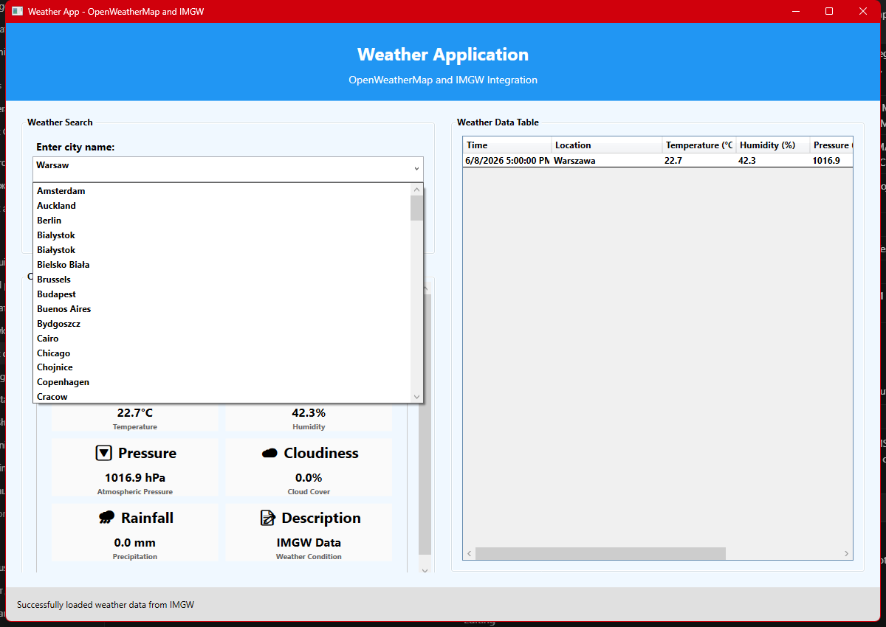

# Weather Application

Desktop WPF app that combines **OpenWeatherMap** and **IMGW** (Polish Institute of Meteorology and Water Management) to show current weather, historical samples, charts, and CSV export.



## Features

- Dual API integration: OpenWeatherMap and IMGW
- Current weather for a selected city
- Dashboard with temperature, humidity, pressure, and rainfall views
- Date filter and OpenWeatherMap past-day samples (10 fixed times)
- CSV export with data source labels
- Modern WPF UI

## Quick start

1. Clone the repository:
   ```bash
   git clone https://github.com/Drakonchik1/WeatherApp.git
   cd WeatherApp
   ```
2. (Optional) Add your OpenWeatherMap API key in `WeatherApp/apikey.txt` — IMGW works without a key.
3. Build and run:
   ```bash
   dotnet build WeatherApp.sln
   dotnet run --project WeatherApp/WeatherApp.csproj
   ```

## Repository layout

```
WeatherApp/
├── WeatherApp/          # WPF application source
├── docs/screenshots/    # App screenshots for README
├── scripts/             # Helper scripts (e.g. screenshot capture)
└── README.md            # This file
```

## Documentation

Detailed setup, API notes, and usage are in [WeatherApp/README.md](WeatherApp/README.md).

## License

Educational project — desktop application development course.
